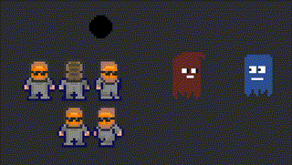

# Bevy Aseprite Ultra

[](./LICENSE)
[](https://crates.io/crates/bevy_aseprite_ultra)

The ultimate bevy aseprite plugin. This plugin allows you to import aseprite files into bevy, with 100% unbreakable
hot reloading. You can also import static sprites from an aseprite atlas type file using slices with functional pivot
offsets and nine-patch (nine-slice) scaling!

| Bevy Version | Plugin Version |
| -----------: | -------------: |
|         0.20 |          0.10.0 |
|         0.19 |          0.9.0 |
|         0.18 |          0.8.1 |
|         0.17 |          0.7.0 |
|         0.16 |          0.6.1 |
|         0.15 |          0.4.1 |
|         0.14 |          0.2.4 |
|         0.13 |          0.1.0 |

## Supported aseprite features

- Animations
- Tags
- Frame duration, repeat, and animation direction
- Layer visibility
- Per-asset layer selection: all layers, visible layers, or layers by name
- Blend modes
- Static slices with pivot offsets and nine-patch (nine-slice) data

## Features in bevy

- Hot reload anything, anytime, anywhere!
- Full control over animations using Components.
- One shot animations and events when they finish.
- Static sprites with slices, pivot offsets and nine-patch scaling (opt in with the `NinePatchBehavior` component).
  Use aseprite for all your icon and UI needs!
- Render to custom material and write shaders ontop.
- Asset processor which converts the aseprite file to a custom format.

(hot reloading requires the `file_watcher` feature in bevy)

## Examples

```bash
cargo run --example animation
cargo run --example slices
cargo run --example nine_patch
cargo run --example ui
cargo run --example queue
cargo run --example manual
cargo run --example move_player
cargo run --example shader
cargo run --example 3d --features 3d
cargo run --example asset_processing --features asset_processing
```



<small> character animation by [Benjamin](https://github.com/headcr4sh) </small>

---

```rust
use bevy::prelude::*;
use bevy_aseprite_ultra::prelude::*;

// Load an animation from an aseprite file
fn spawn_demo_animation(mut cmd: Commands, server: Res<AssetServer>) {
    cmd.spawn((
        AseAnimation {
            aseprite: server.load("player.aseprite"),
            animation: Animation::tag("walk-right")
                // The aseprite repeat config for the tag is ignored on purpose.
                .with_repeat(AnimationRepeat::Count(42))
                .with_speed(2.)
                // The direction is provided by the aseprite config for the tag, but can be overwritten.
                .with_direction(AnimationDirection::PingPong)
                // You can also chain finite animations. Loop animations will never finish.
                .with_then("walk-left", AnimationRepeat::Count(4))
                .with_then("walk-up", AnimationRepeat::Loop),
        },
        // The render target. There are default impls for `Sprite`, `ImageNode`,
        // `MeshMaterial2d` and `MeshMaterial3d`. You may also define your own.
        // Check out the examples.
        Sprite {
            flip_x: true,
            ..default()
        },
    ));
}

// Load a static slice from an aseprite file.
// Works for any static atlas with marked regions aka slices.
fn spawn_demo_static_slice(mut cmd: Commands, server: Res<AssetServer>) {
    cmd.spawn((
        AseSlice {
            name: "ghost_red".into(),
            aseprite: server.load("ball.aseprite"),
        },
        Sprite::default(),
    ));
}

// Animation events.
// This is useful for one shot animations like explosions.
fn despawn_on_finish(mut events: MessageReader<AnimationEvents>, mut cmd: Commands) {
    for event in events.read() {
        match event {
            AnimationEvents::Finished(entity) => cmd.entity(*entity).despawn(),
            // You can also listen for loop cycle repeats
            AnimationEvents::LoopCycleFinished(_entity) => (),
        };
    }
}
```

## Bevy UI

Nothing special to do. Just add the animation or slice together with an `ImageNode`.

```rust
use bevy::prelude::*;
use bevy_aseprite_ultra::prelude::*;

fn spawn_ui(mut cmd: Commands, server: Res<AssetServer>) {
    // animations in bevy ui
    cmd.spawn((
        Node {
            width: Val::Px(100.),
            height: Val::Px(100.),
            ..default()
        },
        ImageNode::default(), // RenderTarget
        AseAnimation {
            aseprite: server.load("player.aseprite"),
            animation: Animation::tag("walk-right"),
        },
    ));

    // slices in bevy ui
    cmd.spawn((
        Node {
            width: Val::Px(100.),
            height: Val::Px(100.),
            border: UiRect::all(Val::Px(5.)),
            ..default()
        },
        ImageNode::default(), // RenderTarget
        AseSlice {
            name: "ghost_red".into(),
            aseprite: server.load("ghost_slices.aseprite"),
        },
    ));
}
```

## Layer selection

By default, only layers that are visible in the aseprite file are rendered.
Change this per asset with the loader settings:

```rust
use bevy::prelude::*;
use bevy_aseprite_ultra::prelude::*;

fn load_player(server: Res<AssetServer>) -> Handle<Aseprite> {
    server
        .load_builder()
        .with_settings::<AsepriteLoaderSettings>(|settings| {
            settings.layer_selection = LayerSelectionSetting::Mask(vec!["body".into()]);
        })
        .load("player.aseprite")
}
```

`LayerSelectionSetting::All` includes hidden layers.
`LayerSelectionSetting::Visible` is the default.
`LayerSelectionSetting::Mask` renders only layers with a listed name,
visible or not.
Unknown names are logged as a warning and ignored.

With asset processing enabled, set the same option in the `.aseprite.meta` file.

## Enable Asset Processing

Simply enable asset processing in your `AssetPlugin` like so:

```rust,no_run
use bevy::prelude::*;

fn main() {
    App::new()
        .add_plugins(DefaultPlugins.set(AssetPlugin {
            mode: AssetMode::Processed,
            ..Default::default()
        }))
        .run();
}
```

Then run with the feature `asset_processing` enabled, e.g.:

```bash
cargo run --features asset_processing
```

Then load your aseprite files in code as usual!
